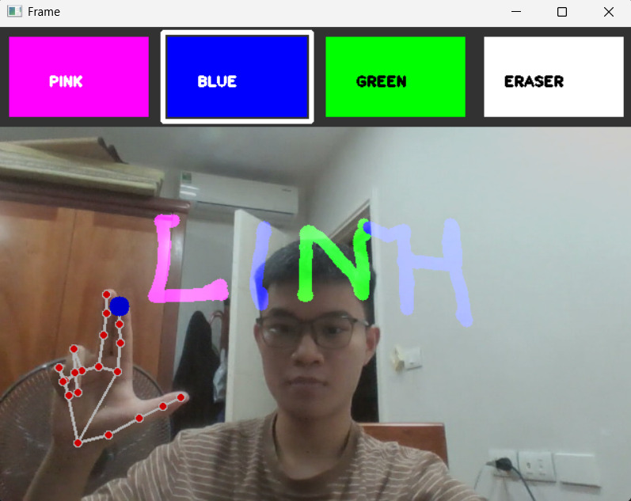
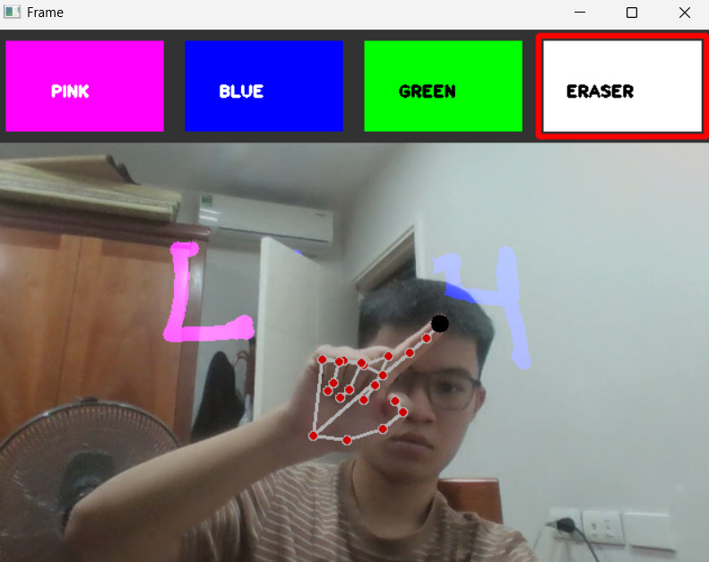

# Virtual Paint 🎨

A virtual painting application using hand tracking with OpenCV and MediaPipe.

The application allows users to draw on the screen using their index finger without touching the computer.

## Features

- Real-time hand tracking
- Draw using the index finger
- Select different colors
- Eraser mode
- Clear the canvas
- Real-time camera display

## Technologies

- Python
- OpenCV
- MediaPipe
- NumPy

## Output Demo

### 1. Paint Mode

Draw on the screen using hand gestures and switch between different colors.



### 2. Eraser Mode

Erase drawings by selecting the eraser tool using hand gestures.



## Project Structure

```text
Virtual-Paint/
│
├── HandTrackingModule.py
├── main.py
├── README.md
├── requirements.txt
└── .gitignore